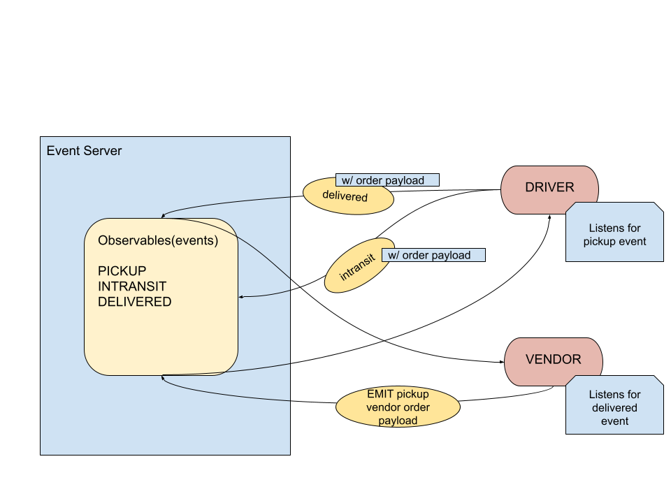

# Lab 11: CAPS/Lab 12: Socket.io

## Author: Katharine Swilley

**CAPS Phase 1:** Begin the build of an application for a product called CAPS - The Code Academy Parcel Service. In this sprint, we’ll build out a system that emulates a real world supply chain. CAPS will simulate a delivery service where vendors (such a flower shops) will ship products using our delivery service and when our drivers deliver them, each vendor will be notified that their customers received what they purchased.

**CAPS Phase 2:** Continue working on a multi-day build of our delivery tracking system, creating an event observable over a network with Socket.io.

**CAPS Phase 3:** Complete work on a multi-day build of our delivery tracking system, adding queued delivery.

### UML

;
